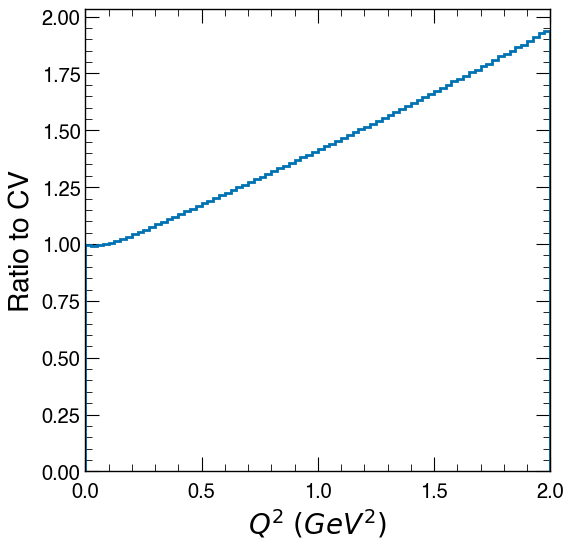

# Part 1: Understanding the package

# Writing a configuration file
A FHICL file ("ParameterHeader") is used to initiate nusystematics weight provider. It is sometime not stratightforward writing a ParameterHeader file from scratch. We first write a simpler FHICL file called "ToolConfig", and then use a NuSyst script, `GenerateSystProviderConfigNuSyst`, to convert it into a ParameterHeader file.

## ToolConfig file

An example of a ToolConfig file is provided in [DDAS.TC.fcl](DDAS.TC.fcl):
```
DDAS_ToolConfig:{

  # Name of the systprovider
  tool_type: "DUNEDAS2026ExampleReweighter"

  # Some name
  instance_name: "NuSystTutorial"

  #------ DDAS Exercise 1-1 START

  # Central value
  DIALNAME_central_value: 0
  # List of variations (e.g., X-sigma)
  # - DIALNAME_variation_descriptor: "(START_VALUE, END_VALUE, STEP)"
  # - DIALNAME_variation_descriptor: "[VALUE_0, VALUE_1, VALUE_2, ...]"
  DIALNAME_variation_descriptor: "[+3]"

  #------ DDAS Exercise 1-1 END

  OPT_STRING: "A string can be transferred to ParameterHeader"
  OPT_BOOL: false
  OPT_PSET:{
    OPT_PSET_STRING: "A string inside OPT_PSET"
  }

}

# You can include multiple ToolConfig block in a single file
# At the end, make a list out of them
syst_providers: [
  DDAS_ToolConfig
]
```

## ParameterHeader file

You can then run `GenerateSystProviderConfigNuSyst -c <ToolConfig FHICL file> -o <Output name for the ParameterHeader FHICL file>` to convert the ToolConfig file into a ParameterHeader file

Each systprovider module contains a member function `BuildSystMetaData` that should be defined by the module developer, which parses the ToolConfig contents. 

You may have noticed following line printed from `GenerateSystProviderConfigNuSyst`:
```
[DUNEDAS2026ExampleReweighter::BuildSystMetaData] Called
[DUNEDAS2026ExampleReweighter::BuildSystMetaData] No dial is set
```
Let's see what we have in BuildSystMetaData; [DUNEDAS2026ExampleReweighter_tool.cc](https://github.com/NuSystematics/nusystematics/blob/DDAS2026/src/nusystematics/systproviders/DUNEDAS2026ExampleReweighter_tool.cc#L23-L61)
```
SystMetaData DUNEDAS2026ExampleReweighter::BuildSystMetaData(ParameterSet const &cfg,
                                                     paramId_t firstId) {

  std::cout << "[DUNEDAS2026ExampleReweighter::BuildSystMetaData] Called" << std::endl;

  SystMetaData smd;

  // Name of the dials that are supported by this module
  std::vector<std::string> AvailPNames = {"DialA", "DialB"};

  // Loop over available names and check if they are specified in ToolConfig
  for(std::string const &pname: AvailPNames){
    systtools::SystParamHeader phdr;
    if (ParseFhiclToolConfigurationParameter(cfg, pname, phdr, firstId)) {
      printf("[DUNEDAS2026ExampleReweighter::BuildSystMetaData] %s is found from ToolConfig\n", pname.c_str());
      phdr.systParamId = firstId++;
      smd.push_back(phdr);
    }
  }
  if(smd.size()==0){
    std::cout << "[DUNEDAS2026ExampleReweighter::BuildSystMetaData] No dial is set" << std::endl;
  }
...
```
As you can see, this module supports {"DialA", "DialB"}, but we have `DIALNAME` in current ToolConfig file.
 
## :pencil2: Exercise 1-1

Update "DDAS.TC.fcl" and genearate a ParameterHeader file for following purpose:
1. DialA
   1. Central value: 0
   1. We want reweights for -1, 0, +1 sigmas
1. DialB
   1. Central value: 0
   1. We want reweights for -1 , 0, +1 sigmas

If you see
```
[DUNEDAS2026ExampleReweighter::BuildSystMetaData] Called
[DUNEDAS2026ExampleReweighter::BuildSystMetaData] DialA is found from ToolConfig
[DUNEDAS2026ExampleReweighter::BuildSystMetaData] DialB is found from ToolConfig
```
, you are good!

# Running NuSystematics

We now have ParamterHeader file, so we can run NuSystematics. Various downstream packages (CAFMaker, Fitter, etc..) can be used, but NuSystematics provides a simple TreeMaker; "DumpConfiguredTweaksNuSyst":
```
DumpConfiguredTweaksNuSyst -c DDAS.PH.fcl \
-i <Input ROOT file that contains GENIE tree> \
-o NuSystTree.root \
```
The output ROOT file contains two TTrees;
- "events": Event tree
- "tweak_metadata": Metadata contains dial information

# Analyzing NuSyst TreeMaker

Go to [NuSystTreeAna.ipynb](NuSystTreeAna.ipynb)

# Developing a systematics with NuSystematics

## Reweighting to a model with different axial form factor

Let's assume we have an alternative axial form factor model that predicts different cross section as a function Q2:



We will update the behavior of DialA so that it returns a reweight that satisfies following conditions:

1. We want to define this systematics so that a "+1 sigma" variation converts our CV to this alternative model.
   1. RW(+1) = 1 + R
1. Any other X-sigma variation is an inter/extra-polation
   1. RW(sigma) = 1 + sigma*R
1. We want to design this as a linear function in Q2
   1. (1+R) at Q2=0 GeV2: 1.0
   1. (1+R) at Q2=2 GeV2: 2.0

## Dive into systprovider

Now, let's see where we should implement this.

In each systprovider, `GetEventResponse(genie::EventRecord const &ev)` function should be defined.
This is the function that is called for each GENIE EventRecord, and outputs the reweight object.

In the [first block](https://github.com/NuSystematics/nusystematics/blob/DDAS2026/src/nusystematics/systproviders/DUNEDAS2026ExampleReweighter_tool.cc#L94-L101), we use the event variables to calculate the kinematic variables we want to use to calcualte reweights.

- ISLepP4: "I"nitial "S"tate "Lep"ton four-momentum (P4)
  - In a charged-current neutrino interaction, this is for the neutrino
- FSLepP4: "F"inal "S"tate "Lep"ton four-momentum (P4)
  - In a charged-current neutrino interaction, this is for electron/muon/tau

## :pencil2: Exercise 1-2

Using `ISLepP4` and `FSLepP4`, calculate the Q2 of this event, and assign the value to `Q2`.

---

In the [next block](https://github.com/NuSystematics/nusystematics/blob/DDAS2026/src/nusystematics/systproviders/DUNEDAS2026ExampleReweighter_tool.cc#L103-L124), we
1. Check whether a dial is activated
1. If so, for each dial, loop over its variations, evaluate the reweight, and store it to the output reweight object

As you can see, `GetReweight_DialA(Q2, var)` is the function that evaluates the reweight for a given `Q2` and a given variation (`var`).
It is recommended to define all these "calculators" under `src/nusystematics/responsecalculators`.

## :pencil2: Exercise 1-3

Implement our "dial design" into `GetReweight_DialA` function:
[DUNEDAS2026ExampleReweighter_calculator.hh](https://github.com/NuSystematics/nusystematics/blob/DDAS2026/src/nusystematics/responsecalculators/DUNEDAS2026ExampleReweighter_calculator.hh#L10-L14$0)

## Compile and test

You need to compile nusystematics after making our changes.
Go inside `nusystematics-build` directory, and run `make install`.

Then remake the NuSystTree, and validate the dial!

Go to [DialValidation.ipynb](DialValidation.ipynb)

# :house::construction_worker: Homework

In DialA, we used a linear function.
It is sometimes not easy to parametrize the ratio of the two models.
We then use the ratio histogram as a "template" and use (`TH1::GetBinContent` or some kind of inter/extra-polation) it to evaluate the reweight.

The ratio histogram is saved in [Ratio.root](Ratio.root).
Update the behavior of "DialB" to:
1. Use the template histogram.
1. For a given Q2, find the bin that Q2 falls in, and use the BinContent of the bin as the reweight.
1. The path of the ratio rootfile and the histogram name can be configured using the "tool_option" in the fhicl file:
```
  OPT_PSET:{
    ROOTFileName: "/path/to/ROOTFILE.root"
    HistName: "HistogramName"
  }
```
